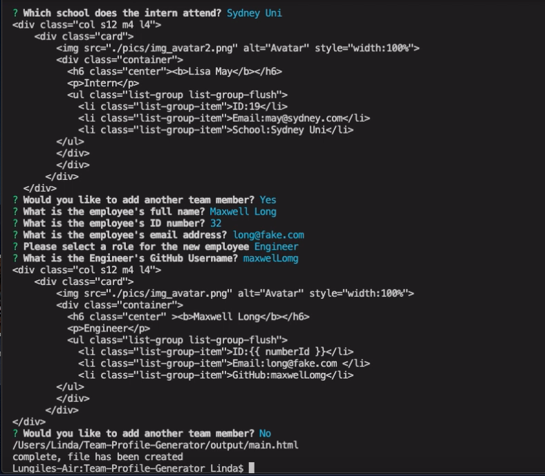

# A Team Profile Generator

## Description

As an employer / administrator youre able to enter information regarding your team and an html profile will be genrated with all the information. Such a employee id, github address, email.

## Demo

## Table of Contents 

* [Installation](#installation)
* [Usage](#usage)
* [License](#license)
* [Tests](#tests)
* [Questions](#questions)

## Installation

Npm Install

## Usage

Demo

## License

MIT License

## Tests

To run tests, run the following command:
npm test

## Questions

If you have any questions please contact me directly here: (https://api.github.com/users/lindahlubi).